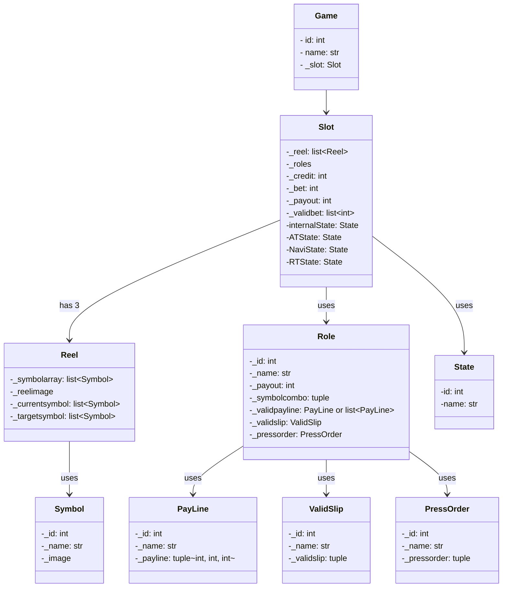

## mermaid記法

## myappのクラス図

```mermaid

classDiagram

    class Game {
        - id: int
        - name: str
        - _slot: Slot
    }
    class Slot {
        -_reel: list~Reel~
        -_roles
        -_credit: int
        -_bet: int
        -_payout: int
        -_validbet: list~int~
        -internalState: State
        -ATState: State
        -NaviState: State
        -RTState: State
    }
    class Reel {
        -_symbolarray: list~Symbol~
        -_reelimage
        -_currentsymbol: list~Symbol~
        -_targetsymbol: list~Symbol~
    }
    class Symbol {
        -_id: int
        -_name: str
        -_image
    }
    class PayLine {
        -_id: int
        -_name: str
        -_payline: tuple~int, int, int~
    }
    class Role {
        -_id: int
        -_name: str
        -_payout: int
        -_symbolcombo: tuple
        -_validpayline: PayLine or list~PayLine~
        -_validslip: ValidSlip
        -_pressorder: PressOrder
    }
    class ValidSlip {
        -_id: int
        -_name: str
        -_validslip: tuple
    }
    class PressOrder {
        -_id: int
        -_name: str
        -_pressorder: tuple
    }
    class State {
        -id: int
        -name: str
    }

    Game --> Slot
    Slot --> Reel : has 3
    Reel --> Symbol : uses
    Slot --> State : uses
    Slot --> Role : uses
    Role --> PayLine : uses
    Role --> ValidSlip : uses
    Role --> PressOrder : uses

```

