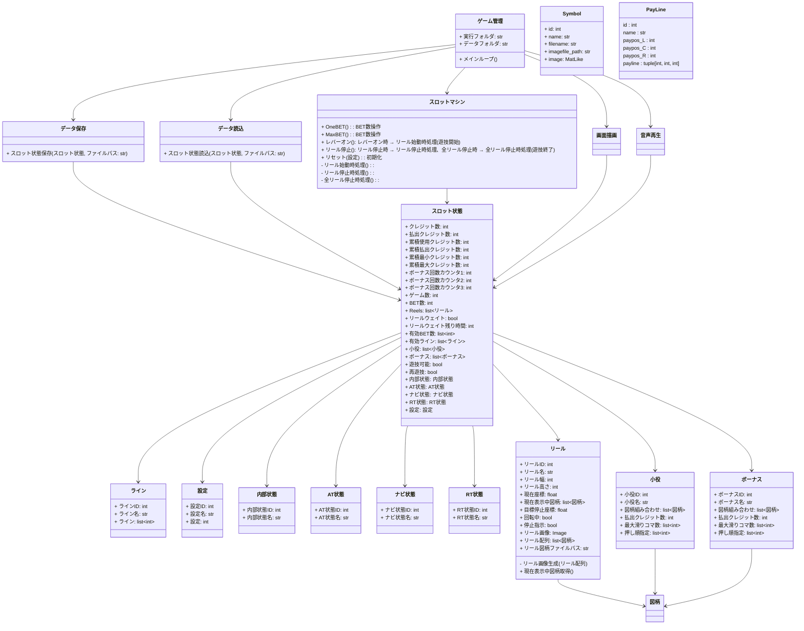

```mermaid

classDiagram

class ゲーム管理 {
    + 実行フォルダ: str
    + データフォルダ: str

    + メインループ()
}

class スロットマシン {
    + OneBET(): BET数操作
    + MaxBET(): BET数操作
    + レバーオン(): レバーオン時 → リール始動時処理(遊技開始)
    + リール停止(): リール停止時 → リール停止時処理、全リール停止時 → 全リール停止時処理(遊技終了)
    + リセット(設定): 初期化
    - リール始動時処理():
    - リール停止時処理():
    - 全リール停止時処理():
}

class スロット状態 {
    + クレジット数: int
    + 払出クレジット数: int
    + 累積使用クレジット数: int
    + 累積払出クレジット数: int
    + 累積最小クレジット数: int
    + 累積最大クレジット数: int
    + ボーナス回数カウンタ1: int
    + ボーナス回数カウンタ2: int
    + ボーナス回数カウンタ3: int
    + ゲーム数: int
    + BET数: int
    + Reels: list~リール~
    + リールウェイト: bool
    + リールウェイト残り時間: int
    + 有効BET数: list~int~
    + 有効ライン: list~ライン~
    + 小役: list~小役~
    + ボーナス: list~ボーナス~
    + 遊技可能: bool
    + 再遊技: bool
    + 内部状態: 内部状態
    + AT状態: AT状態
    + ナビ状態: ナビ状態
    + RT状態: RT状態
    + 設定: 設定
}

class ライン {
    + ラインID: int
    + ライン名: str
    + ライン: list~int~
}

class 設定 {
    + 設定ID: int
    + 設定名: str
    + 設定: int
}

class 内部状態 {
    + 内部状態ID: int
    + 内部状態名: str
}

class AT状態 {
    + AT状態ID: int
    + AT状態名: str
}

class ナビ状態 {
    + ナビ状態ID: int
    + ナビ状態名: str
}

class RT状態 {
    + RT状態ID: int
    + RT状態名: str
}

class 小役 {
    + 小役ID: int
    + 小役名: str
    + 図柄組み合わせ: list~図柄~
    + 払出クレジット数: int
    + 最大滑りコマ数: list~int~
    + 押し順指定: list~int~
}

class ボーナス {
    + ボーナスID: int
    + ボーナス名: str
    + 図柄組み合わせ: list~図柄~
    + 払出クレジット数: int
    + 最大滑りコマ数: list~int~
    + 押し順指定: list~int~
}

class リール {
    + リールID: int
    + リール名: str
    + リール幅: int
    + リール高さ: int
    + 現在座標: float
    + 現在表示中図柄: list~図柄~
    + 目標停止座標: float
    + 回転中: bool
    + 停止指示: bool
    + リール画像: Image
    + リール配列: list~図柄~
    + リール図柄ファイルパス: str

    - リール画像生成(リール配列)
    + 現在表示中図柄取得()
}

class Symbol {
    + id: int
    + name: str
    + filename: str
    + imagefile_path: str
    + image: MatLike
}

class PayLine {
    id : int
    name : str
    paypos_L : int
    paypos_C : int
    paypos_R : int
    payline : tuple[int, int, int]
}

class データ保存 {
    + スロット状態保存(スロット状態, ファイルパス: str)
}

class データ読込 {
    + スロット状態読込(スロット状態, ファイルパス: str)
}

%% --- 関係 ---
ゲーム管理 --> スロットマシン
ゲーム管理 --> 画面描画
ゲーム管理 --> 音声再生
ゲーム管理 --> データ保存
ゲーム管理 --> データ読込

データ保存 --> スロット状態
データ読込 --> スロット状態
スロットマシン --> スロット状態
画面描画 --> スロット状態
音声再生 --> スロット状態

スロット状態 --> リール
リール --> 図柄

スロット状態 --> ライン
スロット状態 --> 設定
スロット状態 --> 内部状態
スロット状態 --> AT状態
スロット状態 --> ナビ状態
スロット状態 --> RT状態

スロット状態 --> 小役
小役 --> 図柄
スロット状態 --> ボーナス
ボーナス --> 図柄

```

