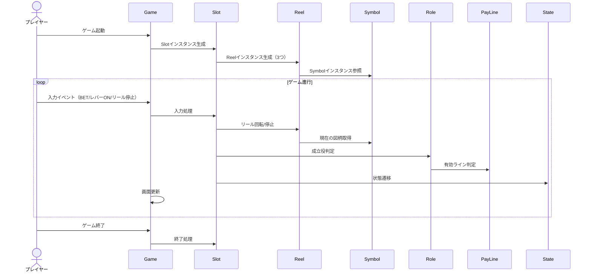

## mermaid記法

## myappのシーケンス図

```mermaid

sequenceDiagram

    actor プレイヤー
    participant Game
    participant Slot
    participant Reel
    participant Symbol
    participant Role
    participant PayLine
    participant State

    プレイヤー->>Game: ゲーム起動
    Game->>Slot: Slotインスタンス生成
    Slot->>Reel: Reelインスタンス生成（3つ）
    Reel->>Symbol: Symbolインスタンス参照

    loop ゲーム進行
        プレイヤー->>Game: 入力イベント（BET/レバーON/リール停止）
        Game->>Slot: 入力処理
        Slot->>Reel: リール回転/停止
        Reel->>Symbol: 現在の図柄取得
        Slot->>Role: 成立役判定
        Role->>PayLine: 有効ライン判定
        Slot->>State: 状態遷移
        Game->>Game: 画面更新
    end

    プレイヤー->>Game: ゲーム終了
    Game->>Slot: 終了処理

```