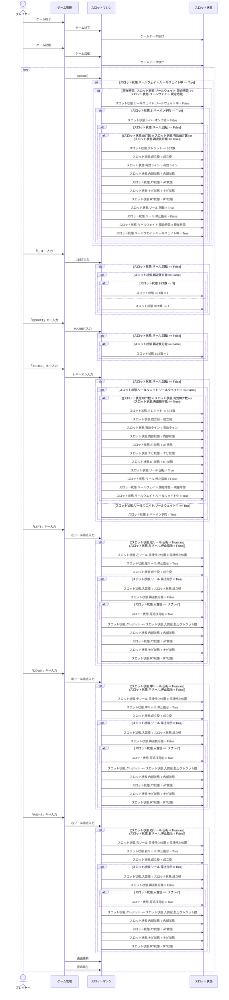

```mermaid


sequenceDiagram
    actor プレイヤー
    participant ゲーム管理
    participant スロットマシン
    participant スロット状態

    プレイヤー->>ゲーム管理: ゲーム終了
    ゲーム管理->>スロットマシン: ゲーム終了
    スロットマシン->>スロット状態: ゲームデータGET

    プレイヤー->>ゲーム管理: ゲーム起動
    ゲーム管理->>スロットマシン: ゲーム起動
    スロットマシン->>スロット状態: ゲームデータSET

    loop
        ゲーム管理->>スロットマシン: update()
        alt スロット状態.リールウェイト.リールウェイト中 == True
            alt (現在時間 - スロット状態.リールウェイト.開始時間) >= スロット状態.リールウェイト.規定時間
                スロットマシン->>スロット状態: スロット状態.リールウェイト.リールウェイト中 = False
                alt スロット状態.レバーオン予約 == True
                    スロットマシン->>スロット状態: スロット状態.レバーオン予約 = False
                    alt スロット状態.リール.回転 == False
                        alt (スロット状態.BET数 in スロット状態.有効BET数) or (スロット状態.再遊技可能 == True)
                            スロットマシン->>スロット状態: スロット状態.クレジット -= BET数
                            スロットマシン->>スロット状態: スロット状態.成立役 = 成立役
                            スロットマシン->>スロット状態: スロット状態.有効ライン = 有効ライン
                            スロットマシン->>スロット状態: スロット状態.内部状態 = 内部状態
                            スロットマシン->>スロット状態: スロット状態.AT状態 = AT状態
                            スロットマシン->>スロット状態: スロット状態.ナビ状態 = ナビ状態
                            スロットマシン->>スロット状態: スロット状態.RT状態 = RT状態
                            スロットマシン->>スロット状態: スロット状態.リール.回転 = True
                            スロットマシン->>スロット状態: スロット状態.リール.停止指示 = False
                            スロットマシン->>スロット状態: スロット状態.リールウェイト.開始時間 = 現在時間
                            スロットマシン->>スロット状態: スロット状態.リールウエイト.リールウェイト中 = True
                        end
                    end
                end
            end
        end

        プレイヤー->>ゲーム管理: 「\」キー入力
        ゲーム管理->>スロットマシン: 1BET入力
        alt スロット状態.リール.回転 == False
            alt スロット状態.再遊技可能 == False
                alt スロット状態.BET数 == 3
                    スロットマシン->>スロット状態: スロット状態.BET数 = 1
                else
                    スロットマシン->>スロット状態: スロット状態.BET数 += 1
                end
            end
        end

        プレイヤー->>ゲーム管理: 「右SHIFT」キー入力
        ゲーム管理->>スロットマシン: MAXBET入力
        alt スロット状態.リール.回転 == False
            alt スロット状態.再遊技可能 == False
                スロットマシン->>スロット状態: スロット状態.BET数 = 3
            end
        end

        プレイヤー->>ゲーム管理: 「右CTRL」キー入力
        ゲーム管理->>スロットマシン: レバーオン入力
        alt スロット状態.リール.回転 == False
            alt スロット状態.リールウエイト.リールウェイト中 == False
                alt (スロット状態.BET数 in スロット状態.有効BET数) or (スロット状態.再遊技可能 == True)
                    スロットマシン->>スロット状態: スロット状態.クレジット -= BET数
                    スロットマシン->>スロット状態: スロット状態.成立役 = 成立役
                    スロットマシン->>スロット状態: スロット状態.有効ライン = 有効ライン
                    スロットマシン->>スロット状態: スロット状態.内部状態 = 内部状態
                    スロットマシン->>スロット状態: スロット状態.AT状態 = AT状態
                    スロットマシン->>スロット状態: スロット状態.ナビ状態 = ナビ状態
                    スロットマシン->>スロット状態: スロット状態.RT状態 = RT状態
                    スロットマシン->>スロット状態: スロット状態.リール.回転 = True
                    スロットマシン->>スロット状態: スロット状態.リール.停止指示 = False
                    スロットマシン->>スロット状態: スロット状態.リールウェイト.開始時間 = 現在時間
                    スロットマシン->>スロット状態: スロット状態.リールウエイト.リールウェイト中 = True
                end
            else スロット状態.リールウエイト.リールウェイト中 == True
                スロットマシン->>スロット状態: スロット状態.レバーオン予約 = True
            end
        end

        プレイヤー->>ゲーム管理: 「LEFT」キー入力
        ゲーム管理->>スロットマシン: 左リール停止入力
        alt (スロット状態.左リール.回転 = True) and (スロット状態.左リール.停止指示 = False)
            スロットマシン->>スロット状態: スロット状態.左リール.目標停止位置 = 目標停止位置
            スロットマシン->>スロット状態: スロット状態.左リール.停止指示 = True
            スロットマシン->>スロット状態: スロット状態.成立役 = 成立役
            alt スロット状態.リール.停止指示 = True
                スロットマシン->>スロット状態: スロット状態.入賞役 = スロット状態.成立役
                スロットマシン->>スロット状態: スロット状態.再遊技可能 = False
                alt スロット状態.入賞役 == リプレイ
                    スロットマシン->>スロット状態: スロット状態.再遊技可能 = True
                end
                スロットマシン->>スロット状態: スロット状態.クレジット += スロット状態.入賞役.払出クレジット数
                スロットマシン->>スロット状態: スロット状態.内部状態 = 内部状態
                スロットマシン->>スロット状態: スロット状態.AT状態 = AT状態
                スロットマシン->>スロット状態: スロット状態.ナビ状態 = ナビ状態
                スロットマシン->>スロット状態: スロット状態.RT状態 = RT状態
            end
        end

        プレイヤー->>ゲーム管理: 「DOWN」キー入力
        ゲーム管理->>スロットマシン: 中リール停止入力
        alt (スロット状態.中リール.回転 = True) and (スロット状態.中リール.停止指示 = False)
            スロットマシン->>スロット状態: スロット状態.中リール.目標停止位置 = 目標停止位置
            スロットマシン->>スロット状態: スロット状態.中リール.停止指示 = True
            スロットマシン->>スロット状態: スロット状態.成立役 = 成立役
            alt スロット状態.リール.停止指示 = True
                スロットマシン->>スロット状態: スロット状態.入賞役 = スロット状態.成立役
                スロットマシン->>スロット状態: スロット状態.再遊技可能 = False
                alt スロット状態.入賞役 == リプレイ
                    スロットマシン->>スロット状態: スロット状態.再遊技可能 = True
                end
                スロットマシン->>スロット状態: スロット状態.クレジット += スロット状態.入賞役.払出クレジット数
                スロットマシン->>スロット状態: スロット状態.内部状態 = 内部状態
                スロットマシン->>スロット状態: スロット状態.AT状態 = AT状態
                スロットマシン->>スロット状態: スロット状態.ナビ状態 = ナビ状態
                スロットマシン->>スロット状態: スロット状態.RT状態 = RT状態
            end
        end

        プレイヤー->>ゲーム管理: 「RIGHT」キー入力
        ゲーム管理->>スロットマシン: 右リール停止入力
        alt (スロット状態.右リール.回転 = True) and (スロット状態.右リール.停止指示 = False)
            スロットマシン->>スロット状態: スロット状態.右リール.目標停止位置 = 目標停止位置
            スロットマシン->>スロット状態: スロット状態.右リール.停止指示 = True
            スロットマシン->>スロット状態: スロット状態.成立役 = 成立役
            alt スロット状態.リール.停止指示 = True
                スロットマシン->>スロット状態: スロット状態.入賞役 = スロット状態.成立役
                スロットマシン->>スロット状態: スロット状態.再遊技可能 = False
                alt スロット状態.入賞役 == リプレイ
                    スロットマシン->>スロット状態: スロット状態.再遊技可能 = True
                end
                スロットマシン->>スロット状態: スロット状態.クレジット += スロット状態.入賞役.払出クレジット数
                スロットマシン->>スロット状態: スロット状態.内部状態 = 内部状態
                スロットマシン->>スロット状態: スロット状態.AT状態 = AT状態
                スロットマシン->>スロット状態: スロット状態.ナビ状態 = ナビ状態
                スロットマシン->>スロット状態: スロット状態.RT状態 = RT状態
            end
        end

        ゲーム管理->>スロットマシン: 画面更新
        ゲーム管理->>スロットマシン: 音声再生
    end


```